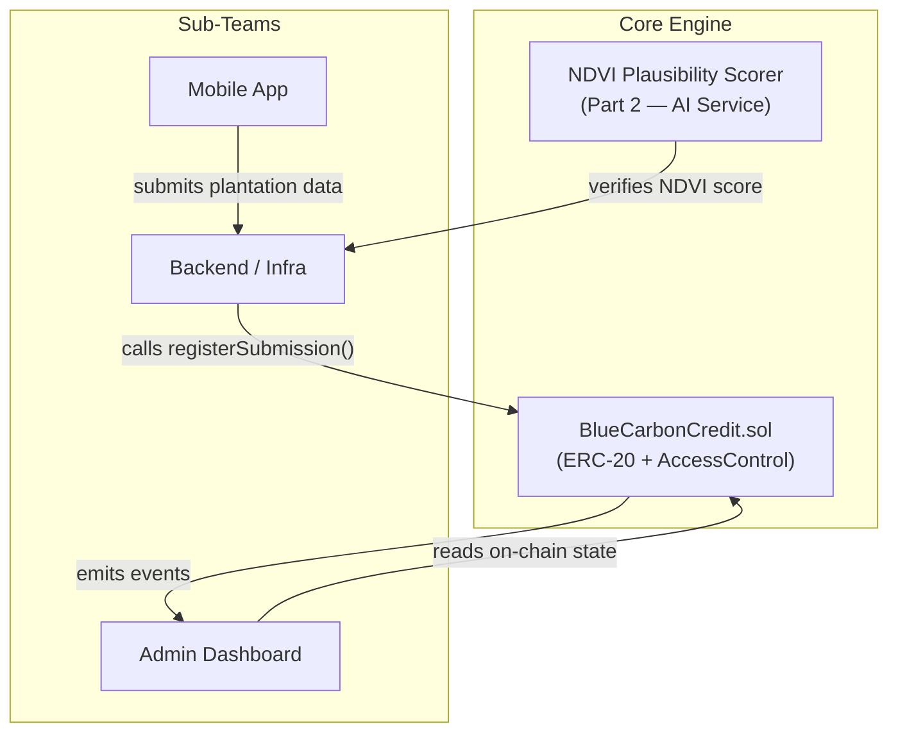
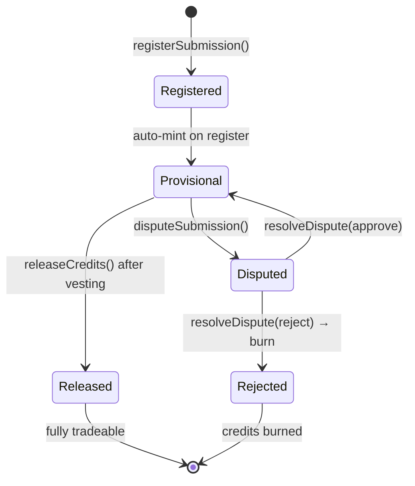

# 🌊 Blue Carbon MRV — Blockchain Registry & Verification

A **Blockchain-Based Blue Carbon Credit Registry** with AI-driven NDVI plausibility scoring, built for transparent and auditable carbon credit lifecycle management.

## Architecture



## Credit Lifecycle



## Quick Start

### Prerequisites
- Node.js ≥ 22.13.0
- Python 3.10+ (for Slither security analysis)
- A Sepolia testnet wallet with ETH ([faucet](https://sepoliafaucet.com/))

### Setup
```bash
# 1. Clone and enter the project
git clone https://github.com/Janshafin/Blue-Carbon-MRV.git
cd Blue-Carbon-MRV
git checkout core-engine

# 2. Install dependencies
npm install

# 3. Set up environment variables
cp .env.example .env
# Edit .env with your real keys

# 4. Compile contracts
npx hardhat compile

# 5. Run tests
npx hardhat test

# 6. Deploy to Sepolia (with Etherscan verification)
npx hardhat ignition deploy ignition/modules/BlueCarbonCredit.ts --network sepolia --verify
```

### Phase 2: NDVI plausibility service

The FastAPI service for Sentinel-2 NDVI and photo-EXIF checks lives in [services/ndvi_scoring](services/ndvi_scoring/README.md). Its provisional request/response contract is available through FastAPI OpenAPI at `/docs` and `/openapi.json` when running locally.

### Security Scan
```bash
pip3 install slither-analyzer solc-select
solc-select install 0.8.28 && solc-select use 0.8.28
slither .
```

## Contract Interface (for Sub-Teams)

### Roles
| Role | Bytes32 | Who |
|------|---------|-----|
| `DEFAULT_ADMIN_ROLE` | `0x00` | Deployer — grants/revokes roles |
| `VERIFIER_ROLE` | `keccak256("VERIFIER_ROLE")` | NCCR verifiers |
| `DISPUTER_ROLE` | `keccak256("DISPUTER_ROLE")` | Auditors / NGOs / citizens |

### Key Functions
| Function | Access | Description |
|----------|--------|-------------|
| `registerSubmission(submissionId, metadataURI, beneficiary, creditAmount)` | VERIFIER | Register plantation + mint provisional tokens |
| `releaseCredits(submissionId)` | VERIFIER | Release tokens after vesting + re-verification |
| `disputeSubmission(submissionId, reason)` | DISPUTER | Flag a submission before release |
| `resolveDispute(submissionId, approved)` | VERIFIER | Approve → resume, Reject → burn |
| `getSubmission(submissionId)` | Public | Read submission state |

### Events (for Dashboard)
```solidity
event SubmissionRegistered(bytes32 indexed submissionId, address indexed beneficiary, uint256 creditAmount);
event CreditProvisional(bytes32 indexed submissionId, address indexed beneficiary, uint256 amount);
event CreditReleased(bytes32 indexed submissionId, address indexed beneficiary, uint256 amount);
event SubmissionDisputed(bytes32 indexed submissionId, address indexed disputedBy, string reason);
event DisputeResolved(bytes32 indexed submissionId, bool approved, address indexed resolvedBy);
```

## Git Workflow
- **`main`** — stable, release-ready (merge via PR only)
- **`core-engine`** — integration branch for Core Engine team
- **`feature/core-engine-*`** — feature branches off `core-engine`

## License
MIT
