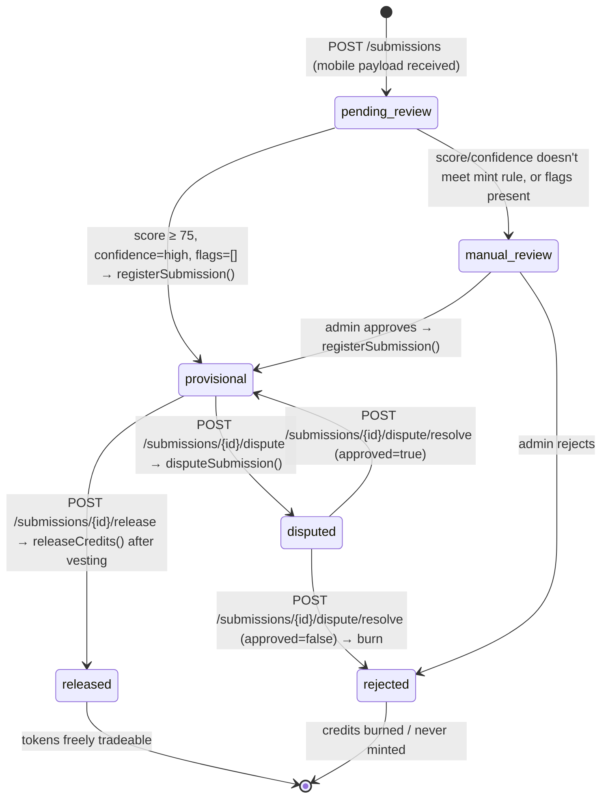

# Blue Carbon MRV — REST API Contract v1

> **Status**: Draft — engine-traced; backend adapter and persistence model not yet implemented  
> **Date**: 2026-08-25  
> **Owner**: Jan (API integration)  
> **Consumers**: Mobile (Chris), Dashboard (Aishu + Jeemol), Backend (Jan + Arlin)

Contract for the planned backend service between the **mobile app**, the **Core Engine** (smart contract + NDVI scorer), and the **admin dashboard**.

The only currently implemented HTTP API is FastAPI's `POST /score-submission`. Its request and response models are the source of truth for scoring fields. The `/api/v1/submissions` routes, backend database, authentication, transaction adapter, and dashboard read model are **not implemented in this repository**. Fields marked **backend-owned** below are required to build those pieces; they are not Solidity or FastAPI model fields.

---

## Sources

| Component | File | What it defines |
|---|---|---|
| Smart contract | `contracts/BlueCarbonCredit.sol` | `Submission` struct, `SubmissionStatus` enum, lifecycle functions, events |
| NDVI scorer | `services/ndvi_scoring/app/models.py` | `ScoreSubmissionRequest`, `ScoreSubmissionResponse`, `PhotoMetadata` |
| Scoring rules | `services/ndvi_scoring/app/scoring.py` | Score computation, EXIF checks, confidence bands, flags |
| Contract script | `scripts/manage-blue-carbon.ts` | `submissionId` hashing (`keccak256`), contract call args |
| Orchestration policy | `CORE_ENGINE_README.md` | Decision matrix (score ≥ 75, high confidence, no flags → provisional mint) |

---

## Submission Lifecycle

The lifecycle is a backend projection of the contract state plus the README policy; it is not a Solidity enum or an implemented REST state machine.



### Status Values (API enum)

| Value | Source | Description |
|---|---|---|
| `pending_review` | Backend-owned (pre-chain) | Submission received; scoring has not completed |
| `manual_review` | Backend-owned (pre-chain) | Scoring completed but did not meet the clean auto-mint rule; awaiting a human decision |
| `provisional` | Contract enum index `1` | `registerSubmission()` called; tokens minted but locked |
| `released` | Contract enum index `2` | `releaseCredits()` called; tokens transferable |
| `disputed` | Contract enum index `3` | `disputeSubmission()` called; lifecycle paused |
| `rejected` | Contract index `4`, or backend-owned pre-chain decision | A rejected dispute burns locked tokens; a manual pre-chain rejection has no on-chain record |

> **Note**: Solidity also declares `Registered` at enum index `0`, but `registerSubmission()` immediately writes `Provisional`; no public contract function creates a persistent `Registered` submission. It is therefore not a normal API state. `pending_review`, `manual_review`, and a pre-chain `rejected` decision require a backend database.

---

## Common Schemas

### ErrorResponse

Every non-2xx response uses this envelope.

```json
{
  "error": {
    "code": "SUBMISSION_NOT_FOUND",
    "message": "No submission exists with id 'abc123'.",
    "details": {}
  }
}
```

| Field | Type | Required | Description |
|---|---|---|---|
| `error.code` | `string` | ✅ | Machine-readable error code (see Error Codes table) |
| `error.message` | `string` | ✅ | Human-readable description |
| `error.details` | `object` | ❌ | Additional context (validation errors, field paths) |

### Error Codes

| Code | HTTP Status | When |
|---|---|---|
| `VALIDATION_ERROR` | `422` | Request body fails schema validation |
| `SUBMISSION_NOT_FOUND` | `404` | Backend record is absent, or the decoded contract revert is `SubmissionNotFound` |
| `SUBMISSION_ALREADY_EXISTS` | `409` | Duplicate submission ID (maps to contract's `SubmissionAlreadyExists`) |
| `INVALID_STATUS_TRANSITION` | `409` | Action not allowed in current status (maps to contract's `InvalidStatus`) |
| `VESTING_NOT_ELAPSED` | `409` | Release attempted before vesting period (maps to contract's `VestingNotElapsed`) |
| `ZERO_CREDIT_AMOUNT` | `422` | Contract rejected `creditAmount == 0` (`ZeroCreditAmount`) |
| `ZERO_ADDRESS` | `422` | Contract rejected the zero beneficiary address (`ZeroAddress`) |
| `CONTRACT_ROLE_DENIED` | `403` | Transaction signer lacks the contract role (OpenZeppelin `AccessControlUnauthorizedAccount`) |
| `UNAUTHORIZED` | `401` | Missing or invalid authentication |
| `FORBIDDEN` | `403` | Authenticated but lacks required role |
| `SCORING_SERVICE_UNAVAILABLE` | `503` | Scorer is unreachable or misconfigured. A Sentinel imagery failure is instead a valid score result with `sentinel_imagery_unavailable`. |
| `BLOCKCHAIN_ERROR` | `502` | On-chain transaction failed |
| `INTERNAL_ERROR` | `500` | Unexpected server error |

> The existing FastAPI scorer does **not** currently return this envelope: FastAPI validation and its configuration error use the framework's `detail` body. The future backend adapter must normalize scorer, script, RPC, and contract-revert failures into this envelope. `BLOCKCHAIN_ERROR` is only for failures that cannot be decoded to one of the specific contract errors above.

### PhotoMetadata

From `services/ndvi_scoring/app/models.py` → `PhotoMetadata`:

```json
{
  "gps_latitude": -3.4653,
  "gps_longitude": 114.0917,
  "captured_at": "2024-01-20T09:30:00Z"
}
```

| Field | Type | Required | Constraints | Description |
|---|---|---|---|---|
| `gps_latitude` | `float | null` | ❌ | `[-90, 90]` | EXIF GPS latitude. Null if stripped. Produces `photo_gps_missing` flag. |
| `gps_longitude` | `float | null` | ❌ | `[-180, 180]` | EXIF GPS longitude. Null if stripped. |
| `captured_at` | `datetime | null` | ❌ | ISO 8601 | EXIF capture timestamp. Null if stripped. Produces `photo_timestamp_missing` flag. |

### ScoreResult

From `services/ndvi_scoring/app/models.py` → `ScoreSubmissionResponse`:

```json
{
  "score": 90,
  "confidence_band": "high",
  "flags": [],
  "ndvi_before": 0.18,
  "ndvi_after": 0.56
}
```

| Field | Type | Required | Constraints | Description |
|---|---|---|---|---|
| `score` | `integer` | ✅ | `[0, 100]` | Explainable NDVI/EXIF plausibility score |
| `confidence_band` | `string` | ✅ | `"low" | "medium" | "high"` | Derived: ≥75 → high, ≥50 → medium, else low |
| `flags` | `string[]` | ✅ | | Machine-readable flag codes (see below) |
| `ndvi_before` | `float | null` | ✅ | `[-1, 1]` | Mean NDVI near claimed planting date |
| `ndvi_after` | `float | null` | ✅ | `[-1, 1]` | Mean NDVI from recent Sentinel-2 window |

### Known Flag Values

From `services/ndvi_scoring/app/scoring.py`:

| Flag | Trigger |
|---|---|
| `sentinel_imagery_unavailable` | Sentinel-2 request failed or returned no valid pixels |
| `low_current_vegetation` | Recent NDVI < 0.20 |
| `no_meaningful_vegetation_increase` | NDVI change < 0.05 |
| `photo_gps_missing` | EXIF GPS latitude or longitude is null |
| `photo_gps_mismatch` | EXIF GPS > 1 km from claimed location |
| `photo_timestamp_missing` | EXIF captured_at is null |
| `photo_timestamp_mismatch` | EXIF timestamp > 45 days from claimed planting date |

---

## Endpoints

---

### `POST /api/v1/submissions`

**Purpose**: Mobile app submits plantation data. Backend stores it, triggers NDVI scoring, and decides whether to auto-mint (provisional) or hold for manual review.

#### Request Body

```json
{
  "latitude": -3.4653,
  "longitude": 114.0917,
  "claimed_planting_date": "2024-01-15",
  "photo_metadata": {
    "gps_latitude": -3.4653,
    "gps_longitude": 114.0917,
    "captured_at": "2024-01-20T09:30:00Z"
  },
  "beneficiary_address": "0xBeneficiaryWalletAddress",
  "metadata_uri": "ipfs://QmEvidenceCID",
  "credit_amount": "100"
}
```

| Field | Type | Required | Constraints | Source |
|---|---|---|---|---|
| `latitude` | `float` | ✅ | `[-90, 90]` | `ScoreSubmissionRequest.latitude` |
| `longitude` | `float` | ✅ | `[-180, 180]` | `ScoreSubmissionRequest.longitude` |
| `claimed_planting_date` | `string` (date) | ✅ | ISO 8601 date | `ScoreSubmissionRequest.claimed_planting_date` |
| `photo_metadata` | `PhotoMetadata` | ✅ | See schema above | `ScoreSubmissionRequest.photo_metadata` |
| `beneficiary_address` | `string` | ✅ | Valid 20-byte `0x` Ethereum address; not the zero address | Solidity `beneficiary` (`address`) |
| `metadata_uri` | `string` | ✅ | No format enforced by the contract or script; policy requires immutable evidence | Solidity `metadataURI` (`string`) |
| `credit_amount` | `string` | ✅ | Positive base-10 decimal accepted by `parseEther()` and representable as `uint256` (e.g. `"100"`, not wei) | Solidity `creditAmount` / script `parseEther()` |

#### Response `201 Created`

```json
{
  "id": "sub_a1b2c3d4",
  "submission_id_hash": "0x<keccak256 bytes32>",
  "status": "pending_review",
  "latitude": -3.4653,
  "longitude": 114.0917,
  "claimed_planting_date": "2024-01-15",
  "photo_metadata": {
    "gps_latitude": -3.4653,
    "gps_longitude": 114.0917,
    "captured_at": "2024-01-20T09:30:00Z"
  },
  "beneficiary_address": "0xBeneficiaryWalletAddress",
  "metadata_uri": "ipfs://QmEvidenceCID",
  "credit_amount": "100",
  "score": null,
  "blockchain": null,
  "created_at": "2026-08-25T13:45:00Z",
  "updated_at": "2026-08-25T13:45:00Z"
}
```

#### Response Fields

| Field | Type | Description |
|---|---|---|
| `id` | `string` | **Backend-owned** unique ID; no engine model defines it |
| `submission_id_hash` | `string` | `keccak256` bytes32 used on-chain (backend computes this) |
| `status` | `string` | **Backend-owned** lifecycle projection described above |
| `score` | `ScoreResult | null` | Null until scoring completes |
| `blockchain` | `BlockchainRecord | null` | Null until an on-chain transaction occurs |
| `created_at` | `datetime` | **Backend-owned** persistence timestamp |
| `updated_at` | `datetime` | **Backend-owned** persistence timestamp |

#### `BlockchainRecord` (populated after on-chain action)

```json
{
  "transaction_hash": "0x...",
  "block_number": 12345678,
  "network": "sepolia",
  "contract_address": "0x815F9122D29471e161D66068Eef9a508EC079442",
  "minted_at": "2026-08-25T14:00:00Z"
}
```

| Field | Type | Description |
|---|---|---|
| `transaction_hash` | `string` | Tx hash of the on-chain action |
| `block_number` | `integer` | **Backend-enriched** from the RPC receipt; the current script does not print it |
| `network` | `string` | **Backend configuration** (e.g. `"sepolia"`) |
| `contract_address` | `string` | **Backend configuration** used by the script |
| `minted_at` | `datetime` | Read from `Submission.mintedAt` after registration; it is not printed by the script |

#### Status Codes

| Status | Condition |
|---|---|
| `201` | Submission created successfully |
| `409` | Duplicate submission (`SUBMISSION_ALREADY_EXISTS`) |
| `422` | Validation error |
| `503` | Scoring service unavailable |

---

### `GET /api/v1/submissions/{id}`

**Purpose**: Retrieve a single submission with full detail. Used by dashboard and mobile.

#### Path Parameters

| Param | Type | Description |
|---|---|---|
| `id` | `string` | Backend submission ID |

#### Response `200 OK`

Same shape as the `POST /api/v1/submissions` response, with `score` and `blockchain` populated when available.

#### Status Codes

| Status | Condition |
|---|---|
| `200` | Success |
| `404` | `SUBMISSION_NOT_FOUND` |

---

### `GET /api/v1/submissions`

**Purpose**: Planned backend list for the admin dashboard.

> This route and every query/pagination field below are **backend-owned and not implemented by the Core Engine**. The Solidity contract can enumerate only on-chain submission IDs; it cannot filter by score, dates, or pre-chain status. Do not treat this section as an engine-derived schema until a persistence/read-model implementation is added.

#### Query Parameters

| Param | Type | Required | Default | Description |
|---|---|---|---|---|
| `status` | `string` | ❌ | — | Filter by status (comma-separated for multiple) |
| `beneficiary_address` | `string` | ❌ | — | Filter by beneficiary wallet |
| `min_score` | `integer` | ❌ | — | Filter score ≥ value |
| `max_score` | `integer` | ❌ | — | Filter score ≤ value |
| `created_after` | `datetime` | ❌ | — | ISO 8601 lower bound |
| `created_before` | `datetime` | ❌ | — | ISO 8601 upper bound |
| `page` | `integer` | ❌ | `1` | Page number (1-indexed) |
| `page_size` | `integer` | ❌ | `20` | Items per page (max `100`) |
| `sort_by` | `string` | ❌ | `created_at` | Sort field: `created_at`, `score`, `status` |
| `sort_order` | `string` | ❌ | `desc` | `asc` or `desc` |

#### Response `200 OK`

```json
{
  "items": [ ],
  "pagination": {
    "page": 1,
    "page_size": 20,
    "total_items": 47,
    "total_pages": 3
  }
}
```

#### Status Codes

| Status | Condition |
|---|---|
| `200` | Success (empty `items` if no matches) |
| `422` | Invalid query parameters |

---

### `POST /api/v1/submissions/{id}/verify`

**Purpose**: Admin/verifier triggers on-chain `registerSubmission()` for a submission in `manual_review`, or rejects it.

Per the orchestration policy: if score/confidence don't meet the auto-mint rule, the backend stores evidence but does **not** call `registerSubmission`. This endpoint lets a human verifier override that decision.

#### Request Body

```json
{
  "approved": true
}
```

| Field | Type | Required | Description |
|---|---|---|---|
| `approved` | `boolean` | ✅ | `true` → proceed to `registerSubmission()` on-chain; `false` → reject |

The Solidity call has no reviewer-note argument. A reviewer note is permissible only after a backend audit-record schema is separately implemented; it is not part of this engine-traced request.

#### Response `200 OK`

Returns the updated submission object with `status` updated to `provisional` (if approved) or `rejected` (if not).

#### Status Codes

| Status | Condition |
|---|---|
| `200` | Verification decision recorded |
| `404` | `SUBMISSION_NOT_FOUND` |
| `409` | `INVALID_STATUS_TRANSITION` — submission is not in `manual_review` |
| `403` | Contract transaction signer lacks `VERIFIER_ROLE` |
| `502` | Blockchain transaction failed |

---

### `POST /api/v1/submissions/{id}/dispute`

**Purpose**: Flag a `provisional` submission. Maps to contract's `disputeSubmission(submissionId, reason)`.

#### Request Body

```json
{
  "reason": "Re-check found no meaningful vegetation increase"
}
```

| Field | Type | Required | Constraints | Source |
|---|---|---|---|---|
| `reason` | `string` | ✅ | No maximum is enforced by the contract or script | `disputeSubmission(…, reason)` |

#### Response `200 OK`

Returns the updated submission object with:
- `status` → `"disputed"`
- `dispute` object populated

```json
{
  "...submission fields...",
  "status": "disputed",
  "dispute": {
    "reason": "Re-check found no meaningful vegetation increase",
    "disputed_by": "0xDisputerAddress"
  }
}
```

#### Dispute Object

| Field | Type | Description |
|---|---|---|
| `reason` | `string` | From contract `Submission.disputeReason` |
| `disputed_by` | `string` | From contract `Submission.disputedBy` |

The contract does not store a dispute timestamp, a resolution flag, a resolution reason, or the resolver in `Submission`. A backend may derive audit data from the `SubmissionDisputed` and `DisputeResolved` events plus block timestamps, but that requires a separately defined backend audit schema.

#### Status Codes

| Status | Condition |
|---|---|
| `200` | Dispute recorded on-chain |
| `404` | `SUBMISSION_NOT_FOUND` |
| `409` | `INVALID_STATUS_TRANSITION` — not in `provisional` (contract enforces `Provisional` only) |
| `403` | Contract transaction signer lacks `DISPUTER_ROLE` |
| `502` | Blockchain transaction failed |

---

### `POST /api/v1/submissions/{id}/dispute/resolve`

**Purpose**: Resolve a disputed submission. Maps to `resolveDispute(submissionId, approved)`.

#### Request Body

```json
{
  "approved": true
}
```

| Field | Type | Required | Source |
|---|---|---|---|
| `approved` | `boolean` | ✅ | `resolveDispute(…, approved)` |

`true` returns the contract submission to `provisional`; `false` sets it to `rejected` and burns its locked credit amount. The management script requires the exact environment mapping `DISPUTE_APPROVED="true"` for approval; any other string resolves as rejection.

#### Response `200 OK`

Returns the updated submission projection with `status` set to `provisional` or `rejected` and the resolution transaction recorded in its backend blockchain record.

#### Status Codes

| Status | Condition |
|---|---|
| `200` | Dispute resolved on-chain |
| `404` | `SUBMISSION_NOT_FOUND` |
| `409` | `INVALID_STATUS_TRANSITION` — not in `disputed` |
| `403` | Contract transaction signer lacks `VERIFIER_ROLE` |
| `502` | Blockchain transaction failed |

---

### `POST /api/v1/submissions/{id}/release`

**Purpose**: Release credits after vesting. Maps to contract's `releaseCredits(submissionId)`.

The contract call accepts only `submissionId`. The README additionally requires an elapsed vesting period, a new clean high-confidence score, and human approval. This API has no re-verification evidence/input model, so this route must not be exposed for production use until the backend defines and persists that workflow. The contract itself enforces only `Provisional`, vesting duration, and `VERIFIER_ROLE`.

#### Request Body

No request body. The script calls `releaseCredits(submissionId)` with only the ID.

#### Response `200 OK`

Returns the updated submission object with `status` → `"released"`.

#### Status Codes

| Status | Condition |
|---|---|
| `200` | Credits released on-chain |
| `404` | `SUBMISSION_NOT_FOUND` |
| `409` | `INVALID_STATUS_TRANSITION` — not in `provisional` |
| `409` | `VESTING_NOT_ELAPSED` — vesting duration hasn't passed |
| `403` | Contract transaction signer lacks `VERIFIER_ROLE` |
| `502` | Blockchain transaction failed |

---

### `GET /api/v1/submissions/{id}/score`

**Purpose**: Retrieve only the NDVI scoring result for a submission. Lightweight read for dashboard score cards.

#### Response `200 OK`

```json
{
  "score": 90,
  "confidence_band": "high",
  "flags": [],
  "ndvi_before": 0.18,
  "ndvi_after": 0.56
}
```

| Field | Type | Description |
|---|---|---|
| `score` | `integer` | From `ScoreSubmissionResponse.score` |
| `confidence_band` | `string` | From `ScoreSubmissionResponse.confidence_band` |
| `flags` | `string[]` | From `ScoreSubmissionResponse.flags` |
| `ndvi_before` | `float | null` | From `ScoreSubmissionResponse.ndvi_before` |
| `ndvi_after` | `float | null` | From `ScoreSubmissionResponse.ndvi_after` |

This response is exactly `ScoreSubmissionResponse`. The path-to-score association and any score execution timestamp require backend persistence; they are not fields of the scorer response.

#### Status Codes

| Status | Condition |
|---|---|
| `200` | Success |
| `404` | `SUBMISSION_NOT_FOUND`, or submission exists but has not yet been scored |

---

## Design Decisions

### Credit Amount Representation

The contract uses `uint256` with 18 decimals (`parseEther`). The API accepts and returns human-readable string amounts (e.g. `"100"` not `"100000000000000000000"`). The backend handles the `parseEther()` conversion.

### Submission ID Generation

Per `scripts/manage-blue-carbon.ts`, the on-chain `submissionId` is `keccak256(utf8(SUBMISSION_ID))` unless the value is already a 32-byte hex string. The backend owns this hash derivation — callers never compute keccak256. Responses expose both:
- `id` — human-readable backend ID
- `submission_id_hash` — bytes32 for on-chain correlation

### Off-Chain Pre-Chain Statuses

`pending_review` and `manual_review` exist only in the backend database. `registerSubmission()` begins every reachable on-chain lifecycle at `Provisional` (index 1). Submissions that fail scoring or are admin-rejected before minting never appear on-chain.

---

## Required Decisions Before Implementation

1. **Authentication and signing**: Define REST caller authentication separately from the wallet that signs contract transactions. The signer must hold `VERIFIER_ROLE` or `DISPUTER_ROLE`; an authenticated REST caller does not automatically have an on-chain role.

2. **Evidence ingestion**: Define how a photo is uploaded and how the backend decodes EXIF. The scorer policy requires decoded EXIF, so it must not rely solely on client-asserted `photo_metadata`. Decide whether the resulting immutable evidence is uploaded by the backend or supplied as a verified URI.

3. **Persistence and reconciliation**: Define a backend data model for IDs, timestamps, score attempts, Sentinel windows, reviewer/audit records, pagination, transaction receipts, retries, and chain-event reconciliation. The contract cannot reconstruct pre-chain status, scores, location, dates, or photo metadata.

4. **Re-verification**: Define a new evidence-and-score workflow before enabling release. It must persist the new scoring request/result and approval required by the README; the contract and management script cannot receive that evidence.
