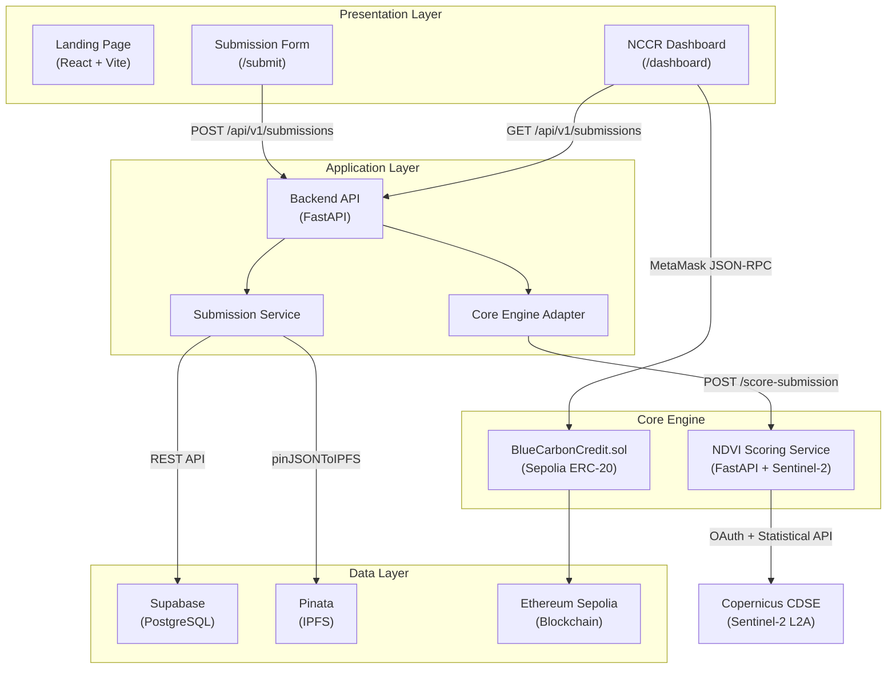
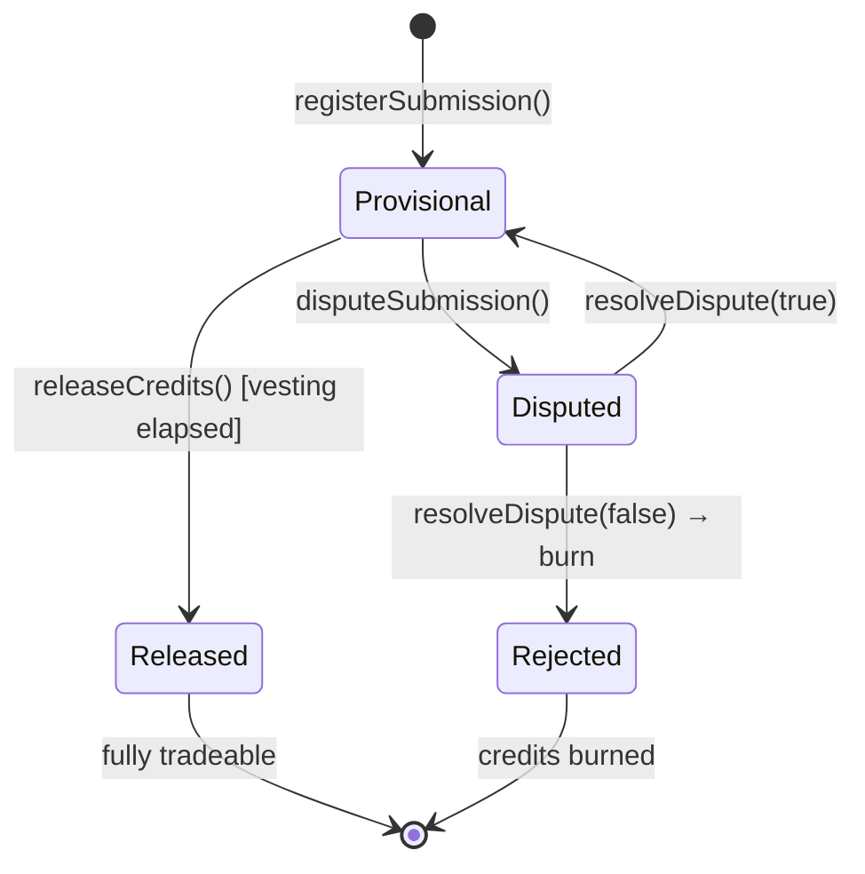
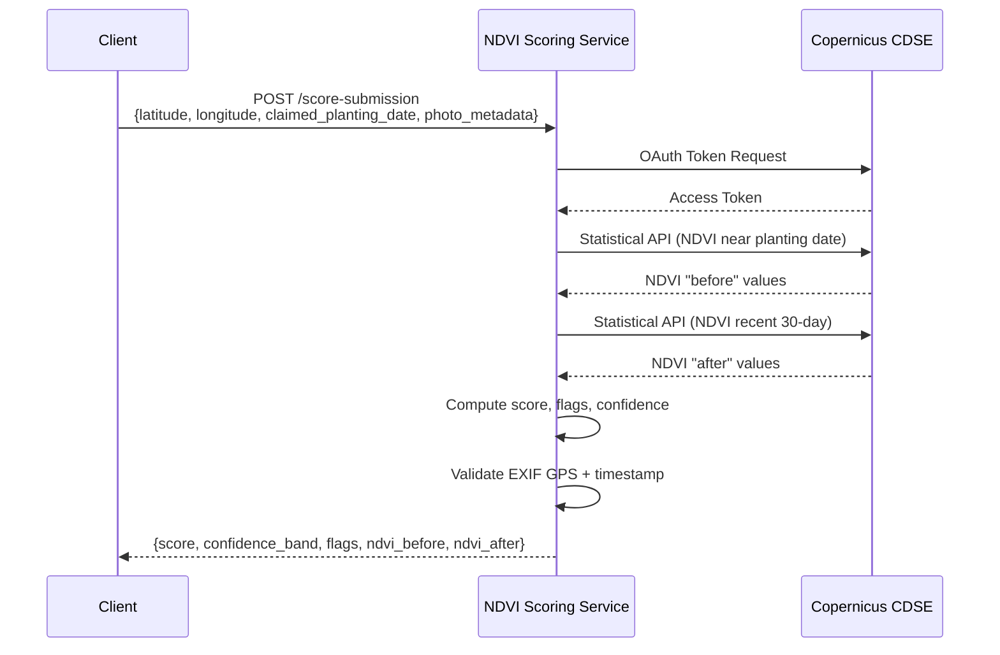
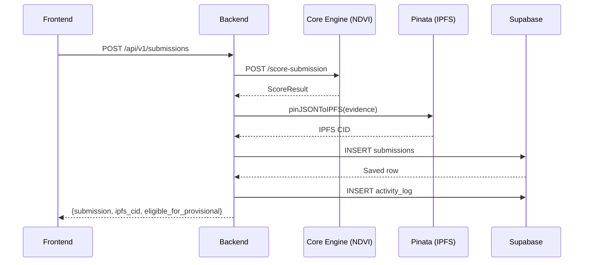
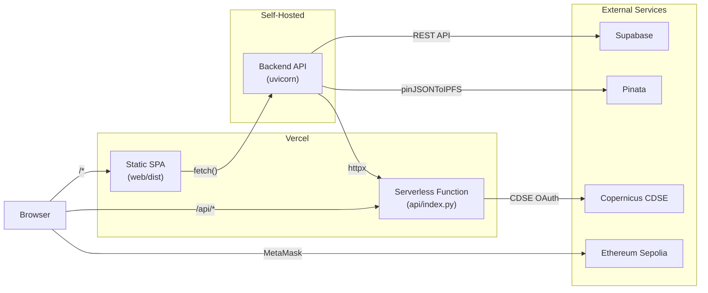

# Architecture Document

## Blue Carbon MRV — System Architecture

> **Version**: 1.0  
> **Date**: 2026-08-28  
> **Owner**: Jan Shafin

---

## 1. Architecture Overview

Blue Carbon MRV follows a **layered, event-driven architecture** with clear separation between the on-chain smart contract layer, off-chain evidence processing, and the web presentation layer. The system is designed for auditability — every state transition produces an immutable record.



---

## 2. Component Architecture

### 2.1 Smart Contract Layer

```
contracts/
└── BlueCarbonCredit.sol          ← ERC-20 + AccessControl

Key Design Decisions:
├── Inherits: ERC20 (OpenZeppelin v5), AccessControl (OpenZeppelin v5)
├── Token: "Blue Carbon Credit" (BCC), 18 decimals
├── Transfer Restriction: _update() override blocks transfers beyond unlocked balance
├── Vesting: immutable vestingDuration enforced on releaseCredits()
├── Enumeration: _submissionIds[] array for dashboard iteration
└── Custom Errors: Gas-efficient typed errors (no require() strings)
```

**State Machine:**



**Storage Layout:**

| Variable | Type | Visibility |
|---|---|---|
| `vestingDuration` | `uint256 immutable` | public |
| `_submissions` | `mapping(bytes32 => Submission)` | private |
| `_submissionIds` | `bytes32[]` | private |
| `lockedBalance` | `mapping(address => uint256)` | public |

### 2.2 NDVI Scoring Service

```
services/ndvi_scoring/
├── app/
│   ├── __init__.py
│   ├── main.py                   ← FastAPI app factory + POST /score-submission
│   ├── models.py                 ← ScoreSubmissionRequest, ScoreSubmissionResponse, PhotoMetadata
│   ├── scoring.py                ← Score computation, EXIF checks, confidence bands, flags
│   ├── imagery.py                ← Sentinel-2 L2A fetch via CDSE Statistical API
│   ├── settings.py               ← Environment configuration (COPERNICUS_CLIENT_ID/SECRET)
│   └── index.py                  ← Vercel serverless entrypoint
├── tests/                        ← 5 pytest tests with deterministic NDVI injection
├── requirements.txt
└── README.md
```

**Data Flow:**



### 2.3 Backend API

```
backend/
├── app/
│   ├── main.py                   ← FastAPI app with CORS, router mount
│   ├── api/
│   │   └── v1/
│   │       └── submissions.py    ← Route handlers (CRUD + review)
│   ├── schemas/
│   │   └── submissions.py        ← Pydantic request/response models
│   └── services/
│       ├── submission_service.py  ← Orchestration: score → pin → persist → log
│       └── core_engine_adapter.py ← HTTP adapter to NDVI scoring service
├── requirements.txt
└── .venv/
```

**Orchestration Flow (Submission Creation):**



### 2.4 Web Frontend

```
web/src/
├── main.tsx                      ← React 19 entry point
├── App.tsx                       ← Path-based routing (/, /submit, /dashboard)
├── index.css                     ← Landing page styles (custom design system)
├── dashboard.css                 ← Dashboard styles (NCCR design system)
├── pages/
│   ├── SubmissionPage.tsx        ← Field submission form
│   └── SubmissionPage.css
├── NCCRRegistryConsole.jsx       ← Admin dashboard (6-section tabbed console)
├── NccrDashboard.tsx             ← Dashboard variant
├── lib/
│   ├── contract.ts               ← ethers.js v6 + MetaMask integration
│   ├── supabase.ts               ← Supabase client initialization
│   ├── supabaseSchema.sql        ← Database DDL (reference)
│   └── seedData.ts               ← Demo data seeder
├── services/
│   ├── apiService.ts             ← Backend REST client
│   └── scoringService.ts         ← Direct NDVI scorer client
├── hooks/
│   └── useOnlineStatus.ts        ← Network connectivity hook
├── types/
│   └── submission.ts             ← TypeScript interfaces
└── assets/
    └── hero-mangrove.jpg
```

**Routing:**

| Path | Component | Purpose |
|---|---|---|
| `/` | `LandingPage` | Marketing page with hero, process, registry preview |
| `/submit` | `SubmissionPage` | Field submission form for NGO teams |
| `/dashboard` | `NCCRRegistryConsole` | Admin dashboard with 6 tabbed sections |

---

## 3. Deployment Architecture



**Vercel Configuration (`vercel.json`):**

| Setting | Value |
|---|---|
| Build command | `npm --prefix web ci && npm --prefix web run build` |
| Output directory | `web/dist` |
| Python functions | `api/**/*.py` (maxDuration: 60s) |
| Rewrites | `/api/*` → `/api/index`, `/*` → `/index.html` (SPA fallback) |

---

## 4. Data Flow Architecture

### 4.1 Write Path (Submission → On-Chain)

```
NGO submits evidence
    → Backend validates input
    → Core Engine scores via Sentinel-2
    → Backend pins evidence to IPFS (Pinata)
    → Backend persists to Supabase (status: "scored")
    → Backend logs activity
    → Dashboard shows in review queue
    → Verifier reviews NDVI + score
    → Verifier signs registerSubmission() via MetaMask
    → Smart contract mints locked BCC tokens
    → Backend updates Supabase (status: "approved", on_chain_tx, on_chain_block)
```

### 4.2 Read Path (Dashboard)

```
Dashboard loads
    → Fetches submissions from Backend API
    → Fetches activity log from Backend API
    → Computes KPI stats client-side
    → Reads on-chain data via ethers.js (balances, roles)
    → Renders review queue, score histograms, parcel map
```

---

## 5. Security Architecture

### 5.1 On-Chain Access Control

```
DEFAULT_ADMIN_ROLE (0x00)          → Deployer wallet
    ├── Can grant/revoke VERIFIER_ROLE
    └── Can grant/revoke DISPUTER_ROLE

VERIFIER_ROLE (keccak256)          → NCCR verifiers
    ├── registerSubmission()
    ├── releaseCredits()
    └── resolveDispute()

DISPUTER_ROLE (keccak256)          → Auditors / NGOs / citizens
    └── disputeSubmission()
```

### 5.2 Environment Isolation

| Variable | Layer | Git-Ignored |
|---|---|---|
| `PRIVATE_KEY` | Root `.env` | ✅ |
| `SEPOLIA_RPC_URL` | Root `.env` | ✅ |
| `ETHERSCAN_API_KEY` | Root `.env` | ✅ |
| `COPERNICUS_CLIENT_ID/SECRET` | Root `.env` | ✅ |
| `SUPABASE_SERVICE_ROLE_KEY` | Root `.env` | ✅ |
| `PINATA_JWT` | Root `.env` | ✅ |
| `VITE_SUPABASE_URL` | `web/.env.local` | ✅ |
| `VITE_SUPABASE_ANON_KEY` | `web/.env.local` | ✅ |

---

## 6. Error Handling Strategy

| Layer | Strategy |
|---|---|
| Smart Contract | Custom Solidity errors (gas-efficient, typed) — `SubmissionNotFound`, `InvalidStatus`, `VestingNotElapsed`, etc. |
| NDVI Scoring | FastAPI validation errors; Sentinel unavailability returns a scored result with `sentinel_imagery_unavailable` flag |
| Backend | `SubmissionServiceError` exceptions caught by route handlers; standardized error envelope |
| Frontend | try/catch with user-facing error messages; online/offline detection via `useOnlineStatus` |
