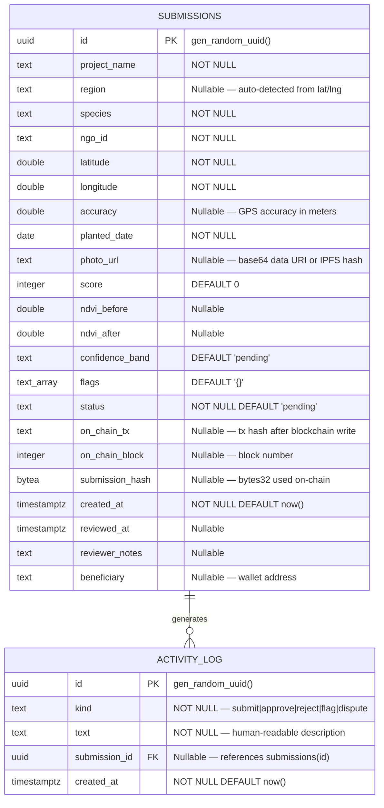

# Database Documentation

## Blue Carbon MRV — Database Schema & Data Model

> **Version**: 1.0  
> **Date**: 2026-08-28  
> **Database**: Supabase (PostgreSQL)  
> **Schema Source**: [`web/src/lib/supabaseSchema.sql`](../web/src/lib/supabaseSchema.sql)

---

## 1. Overview

Blue Carbon MRV uses **Supabase (hosted PostgreSQL)** as the off-chain persistence layer. The database stores submission records, scoring results, on-chain transaction references, and an audit activity log. It complements the on-chain smart contract state, which only tracks submissions after `registerSubmission()` is called.

**Key principle**: The database is the **source of truth for pre-chain state** (`pending`, `scored`, `manual_review`). The smart contract is the source of truth for post-chain state (`Provisional`, `Released`, `Disputed`, `Rejected`).

---

## 2. Entity Relationship Diagram



---

## 3. Table Definitions

### 3.1 `submissions`

The primary table storing all submission data, scoring results, and on-chain references.

| Column | Type | Nullable | Default | Description |
|---|---|---|---|---|
| `id` | `UUID` | No | `gen_random_uuid()` | Primary key |
| `project_name` | `TEXT` | No | — | Display name (e.g., "Avicennia marina Restoration — NGO-IND-2048") |
| `region` | `TEXT` | Yes | — | Auto-detected Indian state from lat/lng coordinates |
| `species` | `TEXT` | No | — | Mangrove species name |
| `ngo_id` | `TEXT` | No | — | Submitting NGO identifier |
| `latitude` | `DOUBLE PRECISION` | No | — | GPS latitude of planting site |
| `longitude` | `DOUBLE PRECISION` | No | — | GPS longitude of planting site |
| `accuracy` | `DOUBLE PRECISION` | Yes | — | GPS accuracy in meters |
| `planted_date` | `DATE` | No | — | Claimed planting date |
| `photo_url` | `TEXT` | Yes | — | Base64 data URI or IPFS hash (e.g., `ipfs://Qm...`) |
| `score` | `INTEGER` | No | `0` | NDVI plausibility score (0–100) |
| `ndvi_before` | `DOUBLE PRECISION` | Yes | — | Mean NDVI near planting date (−1 to 1) |
| `ndvi_after` | `DOUBLE PRECISION` | Yes | — | Mean NDVI from recent Sentinel-2 window (−1 to 1) |
| `confidence_band` | `TEXT` | No | `'pending'` | Confidence level: `pending`, `low`, `medium`, `high` |
| `flags` | `TEXT[]` | No | `'{}'` | Machine-readable flag codes from scoring |
| `status` | `TEXT` | No | `'pending'` | Lifecycle status (see Status Values below) |
| `on_chain_tx` | `TEXT` | Yes | — | Ethereum transaction hash after on-chain write |
| `on_chain_block` | `INTEGER` | Yes | — | Block number of on-chain transaction |
| `submission_hash` | `BYTEA` | Yes | — | `keccak256` bytes32 used as on-chain submission ID |
| `created_at` | `TIMESTAMPTZ` | No | `now()` | Submission creation timestamp |
| `reviewed_at` | `TIMESTAMPTZ` | Yes | — | Timestamp of review action |
| `reviewer_notes` | `TEXT` | Yes | — | Free-text reviewer notes |
| `beneficiary` | `TEXT` | Yes | — | Ethereum wallet address of credit recipient |

### 3.2 `activity_log`

Audit trail of all significant actions in the system.

| Column | Type | Nullable | Default | Description |
|---|---|---|---|---|
| `id` | `UUID` | No | `gen_random_uuid()` | Primary key |
| `kind` | `TEXT` | No | — | Action type: `submit`, `approve`, `reject`, `flag`, `dispute` |
| `text` | `TEXT` | No | — | Human-readable description of the action |
| `submission_id` | `UUID` | Yes | — | Foreign key to `submissions(id)` |
| `created_at` | `TIMESTAMPTZ` | No | `now()` | Timestamp of the action |

---

## 4. Status Values

The `status` column tracks the submission through its lifecycle. Pre-chain statuses exist only in the database; post-chain statuses mirror the smart contract enum.

| Status | Source | On-Chain | Description |
|---|---|---|---|
| `pending` | Backend | ❌ | Submission received; scoring not yet completed |
| `scored` | Backend | ❌ | Scoring completed; awaiting review |
| `approved` | Backend + Contract | ✅ `Provisional` (enum 1) | `registerSubmission()` called; tokens minted but locked |
| `rejected` | Backend or Contract | ✅/❌ `Rejected` (enum 4) | Rejected by reviewer or dispute resolution (tokens burned) |
| `disputed` | Contract | ✅ `Disputed` (enum 3) | `disputeSubmission()` called; lifecycle paused |

> **Note**: The Solidity enum also includes `Registered` (0) and `Released` (2). `Registered` is never a persistent state since `registerSubmission()` immediately sets `Provisional`. `Released` tokens are fully tradeable.

---

## 5. Indexes

| Index Name | Table | Column(s) | Purpose |
|---|---|---|---|
| `idx_submissions_status` | `submissions` | `status` | Dashboard filtering by lifecycle stage |
| `idx_submissions_score` | `submissions` | `score` | Score-based sorting in review queue |
| `idx_submissions_created` | `submissions` | `created_at DESC` | Chronological listing (newest first) |
| `idx_activity_created` | `activity_log` | `created_at DESC` | Activity feed ordering |

---

## 6. Row-Level Security (RLS)

RLS is **enabled** on both tables. Current demo policies allow all operations:

```sql
-- submissions
CREATE POLICY "Allow all on submissions" ON submissions
  FOR ALL USING (true) WITH CHECK (true);

-- activity_log
CREATE POLICY "Allow all on activity_log" ON activity_log
  FOR ALL USING (true) WITH CHECK (true);
```

> [!WARNING]
> **Production Requirement**: These open policies must be replaced with JWT-based authentication policies before production deployment. The `SUPABASE_SERVICE_ROLE_KEY` must only be used server-side (backend), never exposed to the browser.

---

## 7. Data Access Patterns

### 7.1 Backend API → Supabase

The backend uses the **Supabase REST API** (PostgREST) via `httpx` with the service role key:

| Operation | HTTP Method | PostgREST Path | Parameters |
|---|---|---|---|
| Create submission | `POST` | `/rest/v1/submissions` | `select=*`, body: submission JSON |
| List all submissions | `GET` | `/rest/v1/submissions` | `select=*`, `order=created_at.desc` |
| Update submission (review) | `PATCH` | `/rest/v1/submissions` | `id=eq.{id}`, `select=*`, body: patch JSON |
| Create activity entry | `POST` | `/rest/v1/activity_log` | body: activity JSON |
| List activity log | `GET` | `/rest/v1/activity_log` | `select=*`, `order=created_at.desc`, `limit=N` |

### 7.2 Frontend → Backend API

The frontend **never directly queries Supabase**. All data access goes through the backend API:

| Frontend Call | Backend Route | DB Operation |
|---|---|---|
| `createSubmission()` | `POST /api/v1/submissions` | INSERT submissions + activity_log |
| `fetchAllSubmissions()` | `GET /api/v1/submissions` | SELECT submissions |
| `updateSubmissionStatus()` | `POST /api/v1/submissions/{id}/review` | PATCH submissions + INSERT activity_log |
| `fetchActivityLog()` | `GET /api/v1/submissions/activity` | SELECT activity_log |

---

## 8. On-Chain ↔ Off-Chain Data Mapping

| Database Column | Smart Contract Field | Derivation |
|---|---|---|
| `id` (UUID) | — | Backend-generated, no on-chain equivalent |
| `submission_hash` | `submissionId` (bytes32) | `keccak256(utf8(id))` unless already a 32-byte hex |
| `status = 'approved'` | `SubmissionStatus.Provisional` (1) | Set after `registerSubmission()` tx confirmed |
| `on_chain_tx` | — | Transaction hash from MetaMask receipt |
| `on_chain_block` | — | Block number from MetaMask receipt |
| `beneficiary` | `Submission.beneficiary` | Ethereum address |
| `photo_url` (IPFS URI) | `Submission.metadataURI` | IPFS CID pinned by Pinata |
| `score` | — | Off-chain only (scoring service result) |
| `ndvi_before`/`ndvi_after` | — | Off-chain only (Sentinel-2 data) |

---

## 9. Flag Values Reference

The `flags` array column stores machine-readable codes from the NDVI scoring service:

| Flag | Trigger | Scoring Impact |
|---|---|---|
| `sentinel_imagery_unavailable` | Sentinel-2 request failed or returned no valid pixels | Score based on available data |
| `low_current_vegetation` | Recent NDVI < 0.20 | Score 20 |
| `no_meaningful_vegetation_increase` | NDVI change < 0.05 | Score 30 |
| `photo_gps_missing` | EXIF GPS latitude or longitude is null | −10 |
| `photo_gps_mismatch` | EXIF GPS > 1 km from claimed location | −25 |
| `photo_timestamp_missing` | EXIF `captured_at` is null | −10 |
| `photo_timestamp_mismatch` | EXIF timestamp > 45 days from claimed planting date | −15 |

---

## 10. Schema DDL

The full schema DDL is maintained at [`web/src/lib/supabaseSchema.sql`](../web/src/lib/supabaseSchema.sql) and should be executed in the Supabase SQL Editor:

```sql
-- Run in: Supabase Dashboard → SQL → New Query

CREATE TABLE IF NOT EXISTS submissions (...);
CREATE TABLE IF NOT EXISTS activity_log (...);

-- Indexes
CREATE INDEX IF NOT EXISTS idx_submissions_status ON submissions(status);
CREATE INDEX IF NOT EXISTS idx_submissions_score ON submissions(score);
CREATE INDEX IF NOT EXISTS idx_submissions_created ON submissions(created_at DESC);
CREATE INDEX IF NOT EXISTS idx_activity_created ON activity_log(created_at DESC);

-- RLS
ALTER TABLE submissions ENABLE ROW LEVEL SECURITY;
ALTER TABLE activity_log ENABLE ROW LEVEL SECURITY;
```
