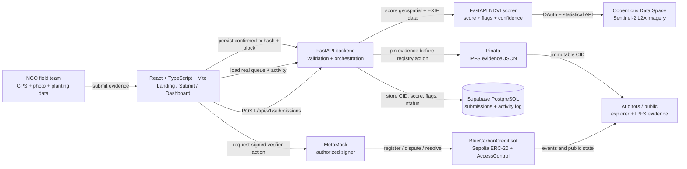
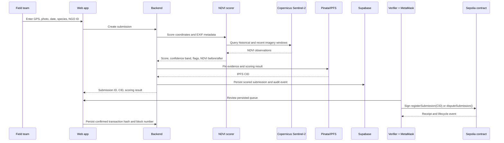

# Blue Carbon MRV — Judge Guide

## 1. The one-minute story

**Problem.** A carbon-credit claim can be self-reported with a photo and a
spreadsheet, but neither proves that restoration happened at the stated place,
that vegetation is present, or that the claim should become tradeable. This is
especially important for mangrove and coastal-restoration projects, where
ground verification is expensive and credits can be issued long before an
ecosystem is established.

**Solution.** Blue Carbon MRV is an evidence-first registry for mangrove
restoration. A field team submits location, date, species, and photo evidence.
The platform checks the claim against Sentinel-2 imagery, stores the evidence
immutably on IPFS, retains a review record in Supabase, and lets an authorized
verifier create a **provisional, non-transferable** credit on Ethereum Sepolia.
Suspicious claims remain reviewable; provisional claims can be disputed before
they are released.

**The key idea.** A token is not a substitute for verification. The blockchain
records the credit lifecycle; satellite data and field evidence determine
whether that lifecycle should begin.

---

## 2. What judges should look at

| Surface | What it demonstrates | Why it matters |
|---|---|---|
| Landing page | Problem, lifecycle, and stakeholder roles | Establishes the real-world use case before the technology |
| Submission page | GPS, photo, planting date, species, NGO ID | Captures the minimum evidence needed to test a restoration claim |
| Backend API | Scores, pins, persists, logs | Keeps sensitive credentials off the client and provides one auditable workflow |
| Dashboard | Persisted queue, NDVI values, flags, review actions | Shows human review rather than black-box auto-approval |
| IPFS record | Immutable metadata CID | Lets evidence be referenced independently of the web database |
| Sepolia contract | Provisional mint, locking, dispute/release rules | Makes lifecycle state changes transparent and enforceable |

---

## 3. Architecture diagram

### Trust boundaries

- **Browser is untrusted.** It collects field inputs and requests a wallet
  signature, but never receives Pinata, Copernicus, or Supabase service keys.
- **Backend is the orchestration boundary.** It validates, requests satellite
  scoring, pins a combined evidence record, writes the database row, and logs
  the action.
- **Blockchain is the enforcement boundary.** Contract roles and token locks
  control credit state; no frontend button alone can mint, release, or dispute.
- **IPFS is the evidence boundary.** The contract references a CID rather than
  a mutable web-server URL.

---

## 4. How one claim moves through the system

### Decision policy

| Signal | Backend result | Human/on-chain result |
|---|---|---|
| Score ≥ 75, high confidence, no flags | `scored`, eligible for provisional mint | Verifier may sign `registerSubmission()` |
| Low score, weak confidence, or any flag | `scored`, flagged for manual review | No automatic mint; verifier investigates or rejects |
| Existing provisional claim has conflicting evidence | `disputed` | Authorized disputer signs `disputeSubmission()` |
| Dispute is accepted/rejected after review | Recorded with transaction receipt | Verifier signs `resolveDispute(true/false)` |

---

## 5. Why this technology stack

| Technology | What it does here | Why it was selected |
|---|---|---|
| React + TypeScript + Vite | Mobile-friendly submission and reviewer experience | Fast iteration, form reliability, and a small deployable web client |
| FastAPI | Backend and NDVI service | Typed validation, automatic OpenAPI docs, and clean Python integration with scientific/geospatial APIs |
| Copernicus CDSE / Sentinel-2 | Vegetation plausibility check | Public Earth-observation data; NDVI gives an explainable vegetation signal rather than an opaque model score |
| Supabase / PostgreSQL | Operational record and review queue | Relational persistence, timestamps, queryability, and audit-log tables |
| Pinata / IPFS | Evidence record storage | CID-based immutable reference that can be stored on-chain and independently inspected |
| Solidity + OpenZeppelin | Credit lifecycle contract | Standard ERC-20 primitives plus battle-tested role-based access control |
| Ethereum Sepolia | Public testnet evidence trail | Lets judges inspect state transitions without financial-value risk |
| MetaMask + ethers.js | Explicit reviewer signing | Keeps signing authority with the role-holding wallet rather than the web server |

---

## 6. Smart-contract lifecycle explained

```mermaid
stateDiagram-v2
    [*] --> Provisional: Verifier registers clean claim
    Provisional: Tokens minted but locked
    Provisional --> Released: Vesting elapsed + verifier release
    Provisional --> Disputed: Authorized disputer challenges claim
    Disputed --> Provisional: Verifier resolves in favor of claim
    Disputed --> Rejected: Verifier rejects; locked credits burn
    Released: Tokens are transferable
```

This design avoids the central failure mode of a normal ERC-20 credit: making
a credit freely tradeable immediately after an unverified claim is submitted.
The contract locks the provisional balance and only `releaseCredits()` unlocks
it after the vesting rule.

---

## 7. What is real today, and what remains demo scope

### Verified implementation

- The deployed Sepolia contract at
  [`0x815F…9442`](https://eth-sepolia.blockscout.com/address/0x815F9122D29471e161D66068Eef9a508EC079442#code)
  has verified source on Blockscout.
- A real Copernicus request has returned Sentinel-derived NDVI values and a
  structured score/flag response.
- The backend workflow has been smoke-tested: score → Pinata CID → Supabase
  submission row → activity record → persisted dispute status.
- The frontend build passes and uses the backend API for submit/queue/activity
  rather than direct client-side service-role access.

### Demo constraints judges should understand

- Sepolia credits have no monetary value.
- NDVI is a plausibility screen, not final proof of carbon sequestration.
- The current demo uses open database access policies; production must add
  authenticated users, restricted RLS policies, rate limits, and role checks.
- A verifier wallet must hold `VERIFIER_ROLE`, and a disputer wallet must hold
  `DISPUTER_ROLE`, before their respective transactions can succeed.
- A production version should use a months-long vesting period; the demo
  contract uses a short duration to make lifecycle testing practical.

---

## 8. Suggested judge walkthrough

1. Start at the landing page: explain the verification gap and the phrase
   **“carbon credits that wait for the truth.”**
2. Open the submission page: show location, date, field photo, species, and
   NGO identifier. Submit a prepared claim; do not type data during judging.
3. Show the returned score, NDVI before/after values, flags, and evidence CID.
4. Open the reviewer dashboard directly at `/dashboard`: show the same
   persisted claim in the real queue. Compare one clean and one flagged claim.
5. Open the IPFS CID and explain that the evidence record is immutable.
6. Approve a clean claim from the verifier wallet. Show MetaMask confirmation,
   then the Sepolia transaction and contract event.
7. Show that the credit is provisional/locked, not instantly tradeable.
8. Open a flagged claim, show why it is not auto-minted, and demonstrate the
   dispute path if the authorized wallet is available.

---

## 9. Questions a judge may ask

**“Why use blockchain if Supabase already records the data?”**  Supabase is the
operational database for search, queueing, and review UX. The blockchain is the
independent, public enforcement layer for issuance, locks, disputes, and final
state transitions. They solve different problems.

**“Why not mint automatically after the score?”**  Satellite scoring identifies
plausibility, not legal or scientific proof of sequestration. The system keeps
human verification in the loop and mints only provisionally.

**“Can someone alter a photo after submission?”**  The submitted evidence JSON
and scoring result are pinned to IPFS. The registered contract record points to
that CID, so replacing a hosted file would not change the referenced evidence.

**“What stops early trading?”**  `lockedBalance` and the ERC-20 `_update()`
restriction block transfers that consume provisional credits. Only the release
workflow unlocks them.

**“What would change for production?”**  Authentication and least-privilege
database rules, independent evidence storage policy, longer vesting, stronger
review governance, replay/rate-limit controls, multiple imagery quality checks,
and external audit procedures.
