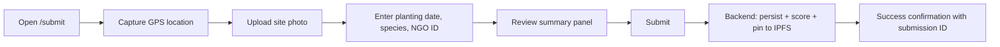
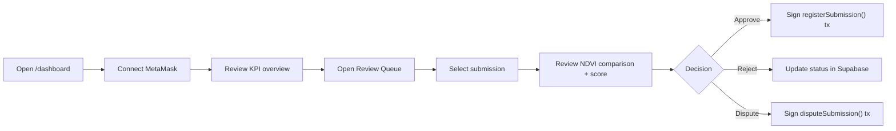

# Product Requirements Document (PRD)

## Blue Carbon MRV — Blockchain Registry & Verification Platform

> **Version**: 1.0  
> **Date**: 2026-08-28  
> **Owner**: Jan Shafin  
> **Domain**: Smart India Hackathon / Ministry of Earth Sciences / NCCR

---

## 1. Problem Statement

Carbon credit markets suffer from a **verification gap**: a timestamp and a spreadsheet cannot establish that a mangrove was actually planted, survived, or belongs at the claimed location. Current systems lack:

- **Independent evidence verification** — Claims are self-reported without satellite cross-validation
- **Locked credit periods** — Credits are tradeable immediately, even before survival confirmation
- **Public dispute mechanisms** — No transparent, on-chain process for challenging suspicious claims
- **Immutable audit trails** — Paper-based or centralized records can be altered after the fact

Blue Carbon MRV addresses these gaps by providing a **satellite-verified, blockchain-backed credit lifecycle** where credits must earn their tradeability through evidence, time, and public scrutiny.

---

## 2. Product Vision

> *Carbon credits that wait for the truth.*

Build verifiable infrastructure for coastal restoration that deserves the same care as the ecosystems it represents — designed to complement NCCR's coastal monitoring mandate with a transparent credit lifecycle.

---

## 3. Target Users

### 3.1 NGO Field Teams (Submitters)

| Attribute | Detail |
|---|---|
| **Role** | Record and submit mangrove restoration evidence |
| **Needs** | Simple mobile-friendly submission form, GPS capture, photo upload |
| **Pain Points** | Slow verification processes, no visibility into submission status |
| **Interaction** | Submit planting proof via web form → track status |

### 3.2 NCCR Verifiers (Reviewers)

| Attribute | Detail |
|---|---|
| **Role** | Review submissions, approve/reject credits, resolve disputes |
| **Needs** | Dashboard with scoring data, NDVI comparison, on-chain action buttons |
| **Pain Points** | Manual review of hundreds of submissions, no standardized scoring |
| **Interaction** | Review queue → NDVI detail → Approve/Reject/Dispute via MetaMask |

### 3.3 Auditors & NGOs (Disputers)

| Attribute | Detail |
|---|---|
| **Role** | Challenge suspicious provisional credits before release |
| **Needs** | Ability to flag submissions with evidence-backed reasons |
| **Pain Points** | No public mechanism to challenge credits once issued |
| **Interaction** | View provisional submissions → Dispute with reason → Monitor resolution |

### 3.4 Public (Registry Viewers)

| Attribute | Detail |
|---|---|
| **Role** | View the state of carbon credits for transparency |
| **Needs** | Public registry showing credit states, evidence links, and on-chain records |
| **Interaction** | Browse landing page → View public registry section |

---

## 4. Product Goals

| # | Goal | Metric |
|---|---|---|
| G1 | Every credit must have satellite and field evidence **before** issuance | 100% of on-chain registrations have a preceding NDVI score |
| G2 | Provisional credits must be non-transferable until re-verification | 0 transfers of locked tokens (enforced by smart contract) |
| G3 | Suspicious claims can be publicly disputed before maturation | Dispute mechanism available for all Provisional submissions |
| G4 | Every lifecycle action is recorded on-chain with an immutable audit trail | All state transitions emit indexed Solidity events |
| G5 | Evidence must be immutable once submitted | All evidence pinned to IPFS before on-chain reference |

---

## 5. Features

### 5.1 Phase 1 — Core Engine (✅ Complete)

| Feature | Status |
|---|---|
| `BlueCarbonCredit.sol` — ERC-20 with AccessControl, staged lifecycle | ✅ Deployed on Sepolia |
| Role-based access: VERIFIER_ROLE, DISPUTER_ROLE, DEFAULT_ADMIN_ROLE | ✅ |
| Provisional minting with locked tokens | ✅ |
| Vesting-enforced release | ✅ |
| Dispute and resolution with token burn | ✅ |
| Transfer restriction override (`_update()`) | ✅ |
| 22 passing Hardhat 3 tests | ✅ |
| Contract management script (`manage-blue-carbon.ts`) | ✅ |

### 5.2 Phase 2 — NDVI Scoring (✅ Complete)

| Feature | Status |
|---|---|
| FastAPI `POST /score-submission` endpoint | ✅ |
| Sentinel-2 L2A imagery via CDSE (Copernicus Data Space) | ✅ |
| NDVI before/after comparison with 30-day windows | ✅ |
| EXIF GPS and timestamp cross-validation | ✅ |
| Explainable scoring rules with flags | ✅ |
| OpenAPI documentation | ✅ |
| 5 passing pytest tests | ✅ |

### 5.3 Phase 3 — Backend API & Web Frontend (✅ Complete)

| Feature | Status |
|---|---|
| FastAPI backend with Supabase persistence | ✅ |
| Pinata IPFS evidence pinning | ✅ |
| Core Engine adapter for scoring orchestration | ✅ |
| Submission creation with auto-scoring | ✅ |
| Dashboard data API (submissions, activity log, stats) | ✅ |
| Review workflow (approve/reject/dispute) | ✅ |
| Landing page with animated hero, process visualization, role cards | ✅ |
| Submission form with GPS, photo upload, species, validation | ✅ |
| NCCR Registry Console (admin dashboard) | ✅ |
| MetaMask wallet integration with Sepolia chain switch | ✅ |
| On-chain registration and dispute from dashboard | ✅ |
| Vercel deployment (web + serverless Python) | ✅ |

### 5.4 Phase 4 — Future Scope

| Feature | Status |
|---|---|
| Dispute Management panel (evidence thread, second reviewer) | 🔲 Scoped |
| Rules & Thresholds panel (configurable scoring parameters) | 🔲 Scoped |
| Audit Trail panel (full action history, exportable) | 🔲 Scoped |
| JWT-based authentication and production RLS | 🔲 Planned |
| Mobile app (native Android/iOS) | 🔲 Planned |
| Production vesting duration (6–24 months) | 🔲 Planned |
| Re-verification workflow before credit release | 🔲 Planned |
| Mainnet deployment | 🔲 Planned |

---

## 6. User Flows

### 6.1 Submission Flow (NGO Field Team)

### 6.2 Verification Flow (NCCR Reviewer)

---

## 7. Success Metrics

| Metric | Target | Measurement |
|---|---|---|
| Submission-to-score latency | < 60 seconds | Time from submission to scoring completion |
| Evidence immutability | 100% | All scored submissions have an IPFS CID |
| Smart contract test coverage | 22/22 tests passing | `npx hardhat test` |
| Dashboard load time | < 3 seconds | First contentful paint on /dashboard |
| Mobile responsiveness | Works on 360px+ | Manual QA across viewports |

---

## 8. Out of Scope (v1)

- Payment processing or real carbon credit trading
- Mainnet deployment with real monetary value
- Mobile native applications (Android/iOS)
- Multi-tenancy or organizational management
- Automated credit release without human approval
- Full audit export with PDF generation
- Internationalization (i18n)
