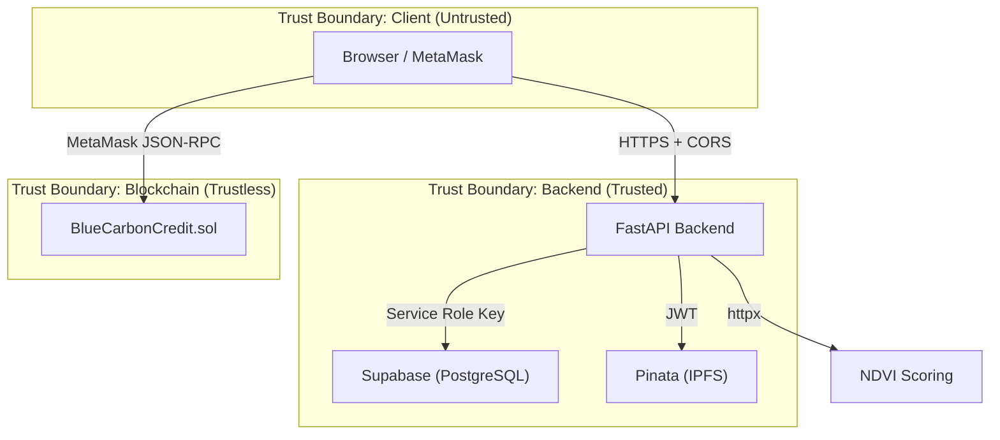

# Security Documentation

## Blue Carbon MRV — Security Architecture & Threat Model

> **Version**: 1.0  
> **Date**: 2026-08-28  
> **Owner**: Jan Shafin

---

## 1. Security Overview

Blue Carbon MRV operates across three trust boundaries: **on-chain** (Ethereum Sepolia smart contract), **off-chain backend** (FastAPI + Supabase), and **client-side** (React SPA + MetaMask). Each boundary has distinct security controls.



---

## 2. Smart Contract Security

### 2.1 Access Control (OpenZeppelin)

The contract uses OpenZeppelin's `AccessControl` with three roles:

| Role | Bytes32 Value | Capabilities | Holders |
|---|---|---|---|
| `DEFAULT_ADMIN_ROLE` | `0x00` | Grant/revoke all roles | Deployer wallet only |
| `VERIFIER_ROLE` | `keccak256("VERIFIER_ROLE")` | `registerSubmission()`, `releaseCredits()`, `resolveDispute()` | NCCR verifier accounts |
| `DISPUTER_ROLE` | `keccak256("DISPUTER_ROLE")` | `disputeSubmission()` | Auditors, NGOs, citizens |

**Key Design Decisions:**
- The deployer is **only** the admin — not automatically a verifier or disputer
- Roles must be explicitly granted after deployment via `grantRole()`
- Role revocation immediately blocks all gated functions

### 2.2 Transfer Restrictions

```solidity
function _update(address from, address to, uint256 value) internal override {
    if (from != address(0) && to != address(0)) {
        uint256 unlocked = balanceOf(from) - lockedBalance[from];
        if (value > unlocked) {
            revert TransferExceedsUnlocked(from, value, unlocked);
        }
    }
    super._update(from, to, value);
}
```

- Minting (`from == address(0)`) and burning (`to == address(0)`) are unrestricted
- Regular transfers are capped at the sender's **unlocked** balance
- Prevents provisional credit trading before verification

### 2.3 Custom Errors (Gas Efficiency)

The contract uses typed custom errors instead of `require()` strings:

| Error | Trigger |
|---|---|
| `SubmissionAlreadyExists(bytes32)` | Duplicate submission ID |
| `SubmissionNotFound(bytes32)` | Query for non-existent submission |
| `InvalidStatus(bytes32, current, expected)` | Wrong lifecycle state for action |
| `VestingNotElapsed(bytes32, releaseTime)` | Release before vesting period |
| `ZeroCreditAmount()` | Zero-value mint attempt |
| `ZeroAddress()` | Zero-address beneficiary |
| `TransferExceedsUnlocked(address, requested, unlocked)` | Transfer of locked tokens |

### 2.4 Static Analysis

The contract is designed to pass **Slither** static analysis:

```bash
pip3 install slither-analyzer solc-select
solc-select install 0.8.28 && solc-select use 0.8.28
slither .
```

### 2.5 Test Coverage

22 test cases covering all security-critical paths:

| Category | Tests | Coverage |
|---|---|---|
| Deployment | 4 | Token name/symbol, vesting, admin role, verifier/disputer roles |
| Registration | 4 | Valid registration, non-verifier revert, duplicate revert, zero amount/address |
| Provisional Minting | 4 | Token minting, locking, transfer prevention, enumeration |
| Vesting & Release | 5 | Pre-vesting revert, post-vesting release, transfer after release, non-verifier revert, double-release revert |
| Dispute Flow | 5 | Dispute creation, release prevention, non-disputer revert, approve resolution, reject-and-burn |
| Access Control | 3 | Grant roles, prevent non-admin grants, revoke-then-block |
| Edge Cases | 2 | Partial unlock/lock balance, non-existent ID revert |

---

## 3. Environment & Secrets Management

### 3.1 Secret Classification

| Secret | Location | Server-Side Only | Git-Ignored |
|---|---|---|---|
| `PRIVATE_KEY` | `.env` | ✅ | ✅ |
| `SEPOLIA_RPC_URL` | `.env` | ✅ | ✅ |
| `ETHERSCAN_API_KEY` | `.env` | ✅ | ✅ |
| `COPERNICUS_CLIENT_ID` | `.env` | ✅ | ✅ |
| `COPERNICUS_CLIENT_SECRET` | `.env` | ✅ | ✅ |
| `SUPABASE_URL` | `.env` | ✅ | ✅ |
| `SUPABASE_SERVICE_ROLE_KEY` | `.env` | ✅ | ✅ |
| `PINATA_JWT` | `.env` | ✅ | ✅ |
| `VITE_SUPABASE_URL` | `web/.env.local` | ❌ (browser) | ✅ |
| `VITE_SUPABASE_ANON_KEY` | `web/.env.local` | ❌ (browser) | ✅ |
| `VITE_CONTRACT_ADDRESS` | `web/.env.local` | ❌ (browser) | ✅ |

### 3.2 Git Ignore Rules

The `.gitignore` explicitly excludes:

```
.env
.env.local
.env.*.local
```

### 3.3 VITE_ Prefix Convention

Only variables prefixed with `VITE_` are exposed to the browser bundle. Backend-only secrets (`SUPABASE_SERVICE_ROLE_KEY`, `PINATA_JWT`, `PRIVATE_KEY`) must **never** use the `VITE_` prefix.

---

## 4. API Security

### 4.1 CORS Policy

**Vercel-deployed NDVI scorer** (`api/index.py`):

```python
allow_origins=["https://blue-carbon-mrv.vercel.app"]
allow_methods=["GET", "POST", "OPTIONS"]
allow_headers=["Content-Type"]
allow_credentials=False
```

**Backend API** (`backend/app/main.py`):

```python
allow_origins=os.getenv("CORS_ORIGINS", "http://localhost:5173").split(",")
allow_methods=["GET", "POST", "OPTIONS"]
allow_headers=["Content-Type"]
```

### 4.2 Authentication Status

> [!WARNING]
> **Current state (Demo)**: No JWT authentication is implemented. The backend accepts unauthenticated requests. Supabase RLS policies allow all operations. This is acceptable for the hackathon demo but must be addressed before production.

**Production Requirements:**
1. Implement JWT-based authentication (Supabase Auth or custom)
2. Replace open RLS policies with role-based policies
3. Separate REST caller authentication from wallet signing authority
4. Validate that the authenticated user has the appropriate on-chain role

### 4.3 Input Validation

| Layer | Validation |
|---|---|
| Frontend | Zod schemas validate all form inputs before submission |
| Backend | Pydantic models validate request bodies |
| Smart Contract | Solidity custom errors enforce zero-address, zero-amount, and status checks |
| NDVI Scorer | FastAPI/Pydantic validate coordinate ranges and date formats |

---

## 5. Data Security

### 5.1 Evidence Immutability

All evidence is **pinned to IPFS** (Pinata) before on-chain registration:

```
Evidence JSON → Pinata pinJSONToIPFS → IPFS CID → metadataURI on-chain
```

Once the `metadataURI` is stored on-chain by `registerSubmission()`, the evidence cannot be altered. The IPFS CID acts as a content-addressable hash guarantee.

### 5.2 Supabase Row-Level Security

RLS is **enabled** but uses open demo policies:

```sql
CREATE POLICY "Allow all on submissions" ON submissions
  FOR ALL USING (true) WITH CHECK (true);
```

**Production policy example:**

```sql
-- Only authenticated users can read
CREATE POLICY "Authenticated read" ON submissions
  FOR SELECT USING (auth.role() = 'authenticated');

-- Only service role can write
CREATE POLICY "Service write" ON submissions
  FOR INSERT WITH CHECK (auth.role() = 'service_role');
```

### 5.3 Photo Handling

- Photos are validated client-side: JPG/PNG only, ≤ 10 MB
- Photos are converted to base64 data URLs before transmission
- The backend pins the base64 data to IPFS as part of the evidence bundle

---

## 6. Blockchain Security

### 6.1 MetaMask Integration

The frontend's wallet connection (`contract.ts`) includes:

1. **Availability check**: `isMetaMaskAvailable()` verifies `window.ethereum` exists
2. **Chain enforcement**: Automatically switches to Sepolia (`0xaa36a7`) or adds it
3. **Signer isolation**: Write operations use `provider.getSigner()`, read operations use the provider directly
4. **Submission ID hashing**: `keccak256(toUtf8Bytes(id))` for consistent on-chain ID derivation

### 6.2 Transaction Safety

- The management script (`manage-blue-carbon.ts`) always `await`s transaction receipts
- The frontend waits for MetaMask confirmation before updating the database
- On-chain transaction hash and block number are persisted to Supabase for audit

### 6.3 Contract Address

| Network | Address | Verified |
|---|---|---|
| Sepolia | `0x815F9122D29471e161D66068Eef9a508EC079442` | ✅ [Blockscout](https://eth-sepolia.blockscout.com/address/0x815F9122D29471e161D66068Eef9a508EC079442#code) |

---

## 7. Threat Model

| Threat | Severity | Mitigation | Status |
|---|---|---|---|
| Unauthorized credit minting | Critical | `VERIFIER_ROLE` enforcement via AccessControl | ✅ Mitigated |
| Transfer of locked tokens | High | `_update()` override checks unlocked balance | ✅ Mitigated |
| Duplicate submission registration | Medium | `SubmissionAlreadyExists` error on duplicate ID | ✅ Mitigated |
| Fabricated NDVI scores | High | Scoring service calls CDSE directly; client cannot substitute scores | ✅ Mitigated |
| EXIF spoofing | Medium | EXIF cross-check with claimed coordinates; flags suspicious mismatches | ✅ Mitigated |
| Unauthenticated API access | High | CORS restricted; no JWT auth yet | ⚠️ Demo only |
| Open Supabase RLS | High | RLS enabled but allows all; needs production policies | ⚠️ Demo only |
| Private key exposure | Critical | `.env` git-ignored; key never in browser code | ✅ Mitigated |
| Service role key in browser | Critical | `SUPABASE_SERVICE_ROLE_KEY` has no `VITE_` prefix | ✅ Mitigated |
| Denial of service on scorer | Low | Sentinel unavailability is a flag, not a crash | ✅ Mitigated |

---

## 8. Security Checklist for Production

- [ ] Implement JWT-based authentication on the backend API
- [ ] Replace open RLS policies with role-based Supabase Auth policies
- [ ] Add rate limiting to all API endpoints
- [ ] Enable Supabase audit logging
- [ ] Set production vesting duration (6–24 months instead of 600 seconds)
- [ ] Deploy to Ethereum mainnet with hardware wallet for admin key
- [ ] Run full Slither analysis and address all findings
- [ ] Implement HTTPS-only cookie-based session management
- [ ] Add CSP (Content Security Policy) headers
- [ ] Conduct third-party smart contract audit
